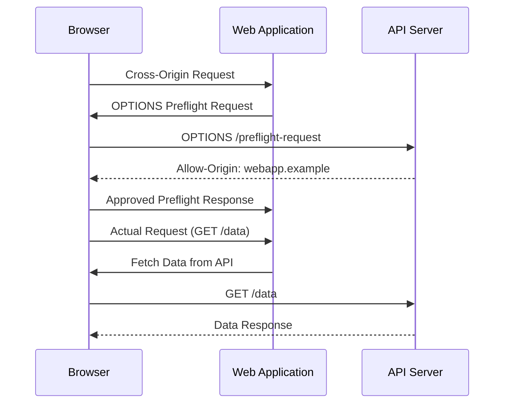

# CORS (Cross-Origin Resource Sharing) Explained 🌐

## Overview 🚀

CORS is a security feature implemented by web browsers to control how resources on different domains can interact.

## How CORS Works 🔄

1. **Browser Makes Request:**
   - Browser sends a request from one origin (e.g., `https://webapp.example`) to another (e.g., `https://api.example`).

2. **Preflight Request (OPTIONS):**
   - Before sending the actual request, the browser sends an OPTIONS request to the server to determine if the actual request is safe to send.

3. **Server Response:**
   - Server responds to the OPTIONS request with CORS headers to specify which origins have permission to access resources.

4. **Actual Request:**
   - If the server approves the request in the OPTIONS response, the browser sends the actual request (GET, POST, etc.) to fetch data or perform actions.

## Key Concepts 📘

- **Origin:** Combination of protocol (http/https), domain, and port (e.g., `https://example.com:443`).
- **Same-Origin Policy:** Security measure that restricts how a document or script loaded from one origin can interact with resources from another origin.

## CORS Headers 🛡️

- **Access-Control-Allow-Origin:** Specifies which origins are allowed to access the resources.
- **Access-Control-Allow-Methods:** Specifies the HTTP methods allowed when accessing the resource.
- **Access-Control-Allow-Headers:** Specifies which headers can be used in the actual request.
- **Access-Control-Allow-Credentials:** Indicates if the resource supports credentials such as cookies or HTTP authentication.
- **Access-Control-Max-Age:** Specifies how long the results of a preflight request can be cached.

## Diagram 📊

