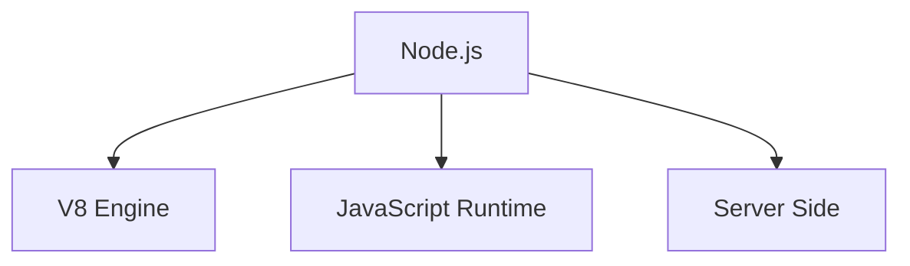
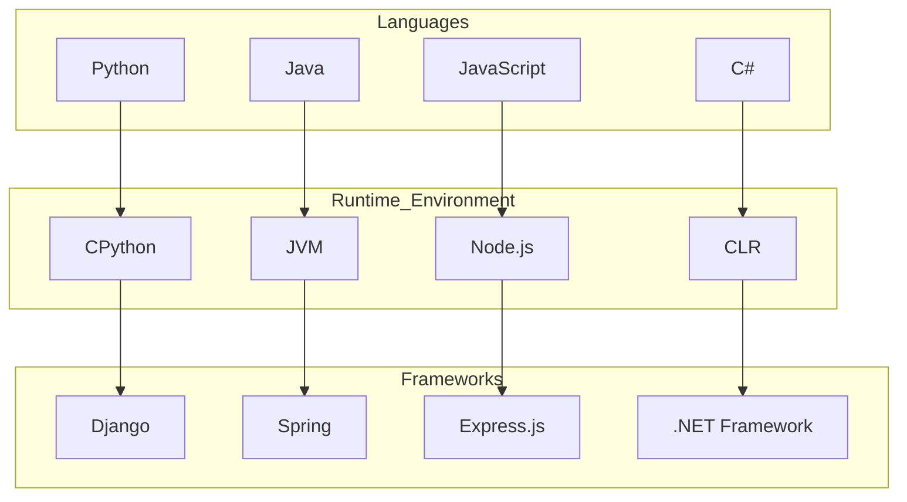
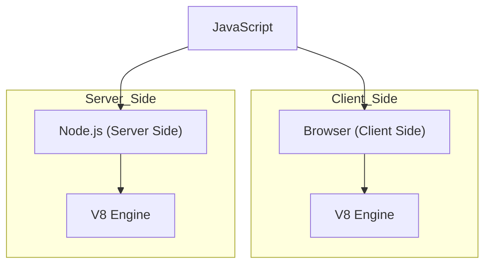
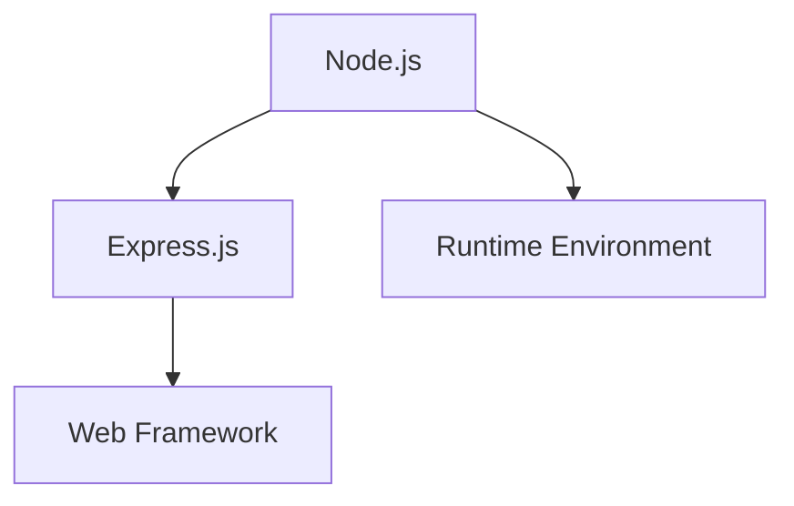
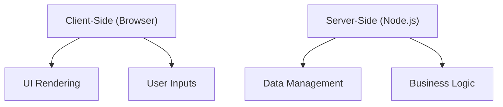
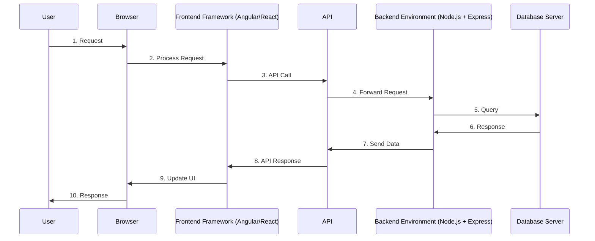

# Q&A: Node.js and Related Topics

## Q1: What is Node.js?

**A1:** 
- Node is neither a language nor a framework.
- Node / Node.js is a **runtime environment** for executing javascript code on the server side.
- Node.js is a JavaScript runtime built on Chrome's V8 JavaScript engine. It allows developers to execute JavaScript code on the server side.

## Q2: How is Node a runtime environment on the server side? What is V8?
**A2:** 
- Node.js provides a runtime environment that allows JavaScript code to run outside of a web browser, typically on a server.
- V8 is the JavaScript engine developed by Google that compiles JavaScript directly to native machine code for faster execution.

- Client Side (Browser):
  - Browser: This represents a web browser (e.g., Google Chrome).
  - JavaScript Engine: Browsers use JavaScript engines to execute JavaScript code. For example, Chrome uses the V8 engine.
    
- Server Side (Node.js):
    - Node.js: This represents the server-side runtime environment that allows JavaScript to be executed on the server.
    - JavaScript Engine: Node.js uses the V8 engine, the same engine used by Chrome, to execute JavaScript code on the server side.
      
- JavaScript: The central language that is executed both on the client side (browser) and the server side (Node.js), using the V8 JavaScript engine.

## Q3: What is the difference between a Runtime environment and a Framework?
**A3:**

- A runtime environment provides the infrastructure needed to execute code, including managing memory, processing input/output, and other core services.

    - Example: Node.js.

- A framework is a collection of pre-written code that provides a structure for developing applications. It typically includes libraries, tools, and best practices to facilitate development. 

    - Example: Express.js.

## Q4: What is the difference between Node.js and Express.js?
**A4:**

- Node.js is a runtime environment for executing JavaScript on the server side.

- Express.js is a web application framework built on top of Node.js that simplifies building web applications and APIs by providing a robust set of features for handling HTTP requests, routing, and middleware.

## Q5: What are the differences between Client-Side (Browser) and Server-Side (Node.js)?
**A5:**

- Client-Side (Browser): Code runs in the user's browser, typically involving the user interface and interactions. It's responsible for rendering the web page and handling user inputs.

- Server-Side (Node.js): Code runs on the server, managing data, handling business logic, and serving responses to client requests. It can access databases, file systems, and other server resources.

## Sequence Diagram: Interaction Flow Between Client-Side and Server-Side with Frontend and Backend Frameworks

### Explanation:
1. User Request: The user initiates a request through the browser.
2. Browser to Frontend: The browser processes the request using frontend frameworks like Angular or React.
3. Frontend to API: The frontend framework makes an API call to the server-side.
4. API to Backend: The API forwards the request to the backend environment, which uses Node.js and Express.
5. Backend to Database: The backend queries the database server.
6. Database Response: The database server processes the query and sends the response back to the backend.
7. Backend to API: The backend sends the data back to the API.
8. API to Frontend: The API sends the response to the frontend framework.
9. Frontend to Browser: The frontend framework updates the UI in the browser with the received data.
10. Browser to User: The browser displays the updated response to the user.
