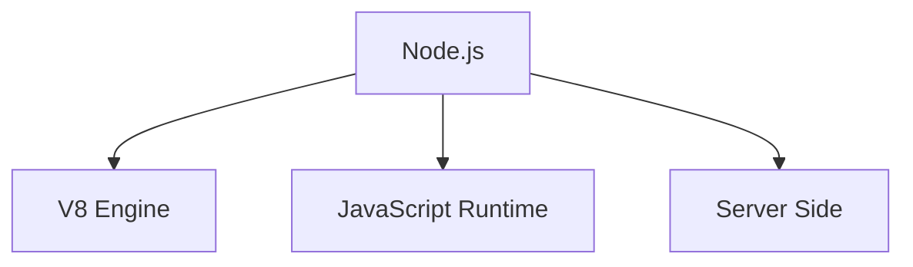
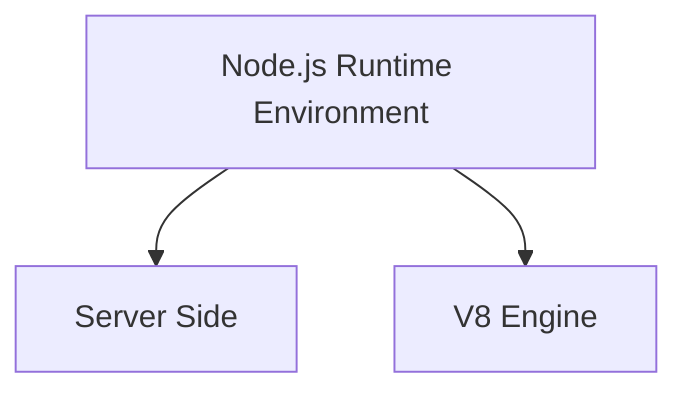
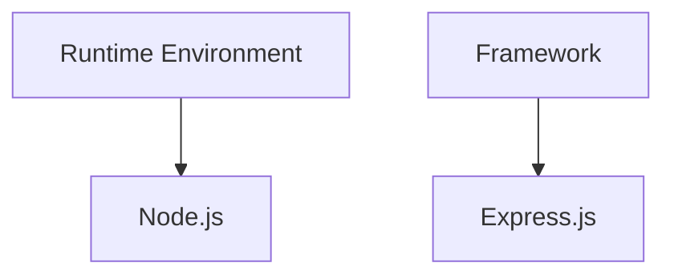
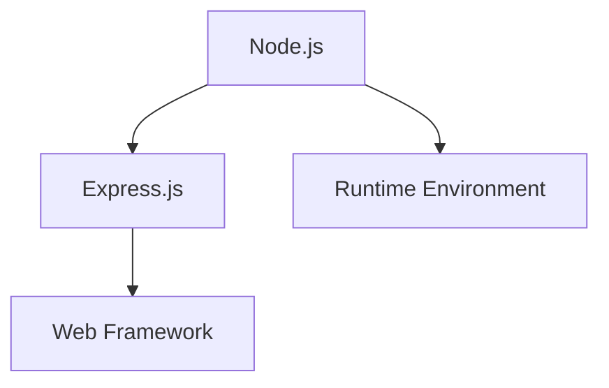
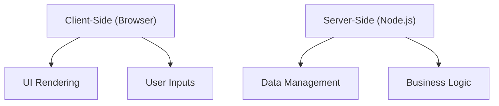

# Q&A: Node.js and Related Topics

## Q1: What is Node.js?

**A1:** Node.js is a JavaScript runtime built on Chrome's V8 JavaScript engine. It allows developers to execute JavaScript code on the server side.

## Q2: How is Node a runtime environment on the server side? What is V8?
**A2:** Node.js provides a runtime environment that allows JavaScript code to run outside of a web browser, typically on a server. V8 is the JavaScript engine developed by Google that compiles JavaScript directly to native machine code for faster execution.

## Q3: What is the difference between a Runtime environment and a Framework?
**A3:**

A runtime environment provides the infrastructure needed to execute code, including managing memory, processing input/output, and other core services.
Example: Node.js.

A framework is a collection of pre-written code that provides a structure for developing applications. It typically includes libraries, tools, and best practices to facilitate development. 
Example: Express.js.

## Q4: What is the difference between Node.js and Express.js?
**A4:**

Node.js is a runtime environment for executing JavaScript on the server side.

Express.js is a web application framework built on top of Node.js that simplifies building web applications and APIs by providing a robust set of features for handling HTTP requests, routing, and middleware.

## Q5: What are the differences between Client-Side (Browser) and Server-Side (Node.js)?
**A5:**

Client-Side (Browser): Code runs in the user's browser, typically involving the user interface and interactions. It's responsible for rendering the web page and handling user inputs.

Server-Side (Node.js): Code runs on the server, managing data, handling business logic, and serving responses to client requests. It can access databases, file systems, and other server resources.

