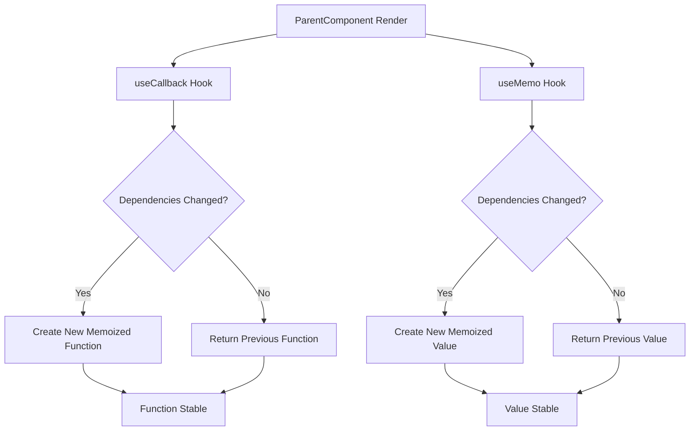

# useCallback vs useMemo

```mermaid
graph TD;
    A[ParentComponent Render] --> B[useCallback Hook]
    A --> C[useMemo Hook]

    B --> D{Dependencies Changed?}
    C --> E{Dependencies Changed?}

    D -- Yes --> F[Create New Memoized Function]
    D -- No --> G[Return Previous Function]

    E -- Yes --> H[Create New Memoized Value]
    E -- No --> I[Return Previous Value]

    F --> J[Function Stable]
    G --> J
    H --> K[Value Stable]
    I --> K
```
