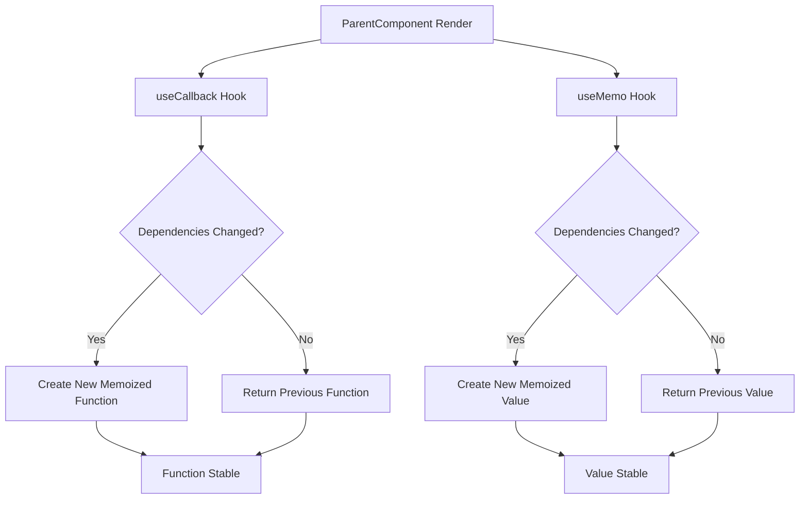

# Difference between `useCallback` and `useMemo`

- Both `useMemo` and `useCallback` are useful for performance optimization.
useMemo will cache the result of the function between re-renders whereas useCallback will cache the function itself between re-renders.

## useCallback

`useCallback` is a hook used to memoize functions. It returns a memoized version of the callback function that only changes if one of the dependencies has changed. It is useful when passing callbacks to child components to prevent unnecessary re-renders.

### Use Case

- Memoizing functions to prevent unnecessary re-renders of child components that depend on those functions.
- Passing callbacks to child components as dependencies in hooks like `useEffect` or `useMemo`.

## useMemo

`useMemo` is a hook used to memoize values. It returns a memoized value that only changes if one of the dependencies has changed. It is useful for optimizing performance by avoiding expensive calculations or computations on every render.

### Use Case

- Memoizing the result of expensive computations or calculations.
- Avoiding unnecessary re-calculations of values in components that depend on those values.

## Summary

- `useCallback` is used to memoize functions, while `useMemo` is used to memoize values.
- `useCallback` is primarily used for optimizing the performance of callback functions, while `useMemo` is used for optimizing the performance of computed values.
- Both hooks rely on a dependency array to determine when to recalculate the memoized value or function.

