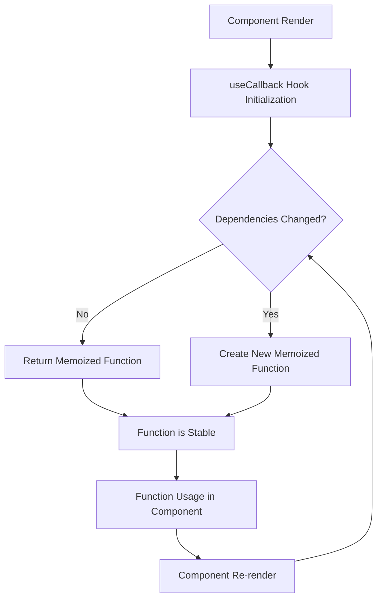

# useCallback Hook

```mermaid
graph TD;
    A[Component Render] --> B[useCallback Hook Initialization]
    B --> C{Dependencies Changed?}
    C -- Yes --> D[Create New Memoized Function]
    C -- No --> E[Return Memoized Function]
    E --> F[Function is Stable]
    D --> F

    F --> G[Function Usage in Component]
    G --> H[Component Re-render]
    H --> C
```
