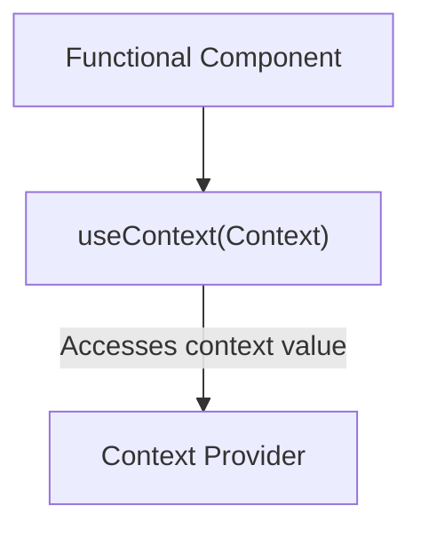

# `useContext` Hook in React

The `useContext` hook is used to access context values in functional components. It allows components to consume values from a context without explicitly passing them through the component tree.


## Usage

- It is used to access context values declared by a `Context.Provider` component higher up in the tree.
- The `useContext` hook takes the context object created by `React.createContext()` as its argument and returns the current context value.

## Syntax

```jsx
const value = useContext(Context);
```
- **Context:** The context object created by React.createContext().
  
## Example:

```jsx
import React from "react";

// Create a context
const NumberContext = React.createContext();

function App() {
  return (
    <NumberContext.Provider value={42}>
      <Display />
    </NumberContext.Provider>
  );
}

function Display() {
  const value = React.useContext(NumberContext);
  return <div>The answer is {value}.</div>;
}

// Render the app
ReactDOM.render(<App />, document.querySelector("#root"));

```

## Benefits
- Eliminates the need for prop drilling to pass data through multiple layers of the component tree.
- Simplifies code by providing a straightforward way to access shared values.
