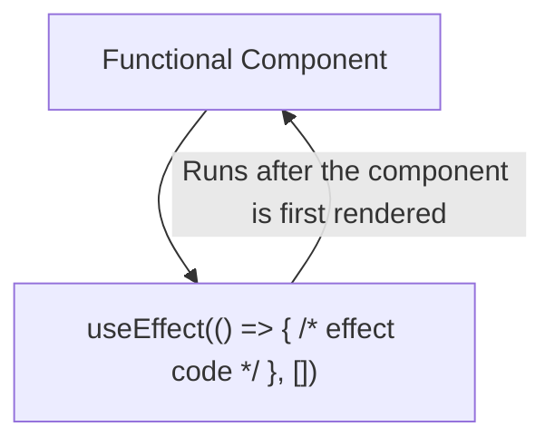
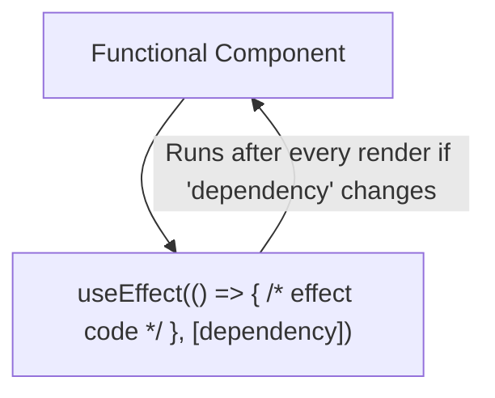
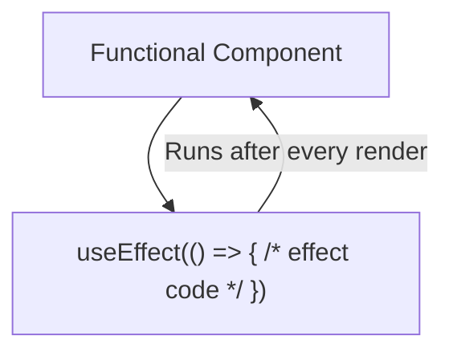
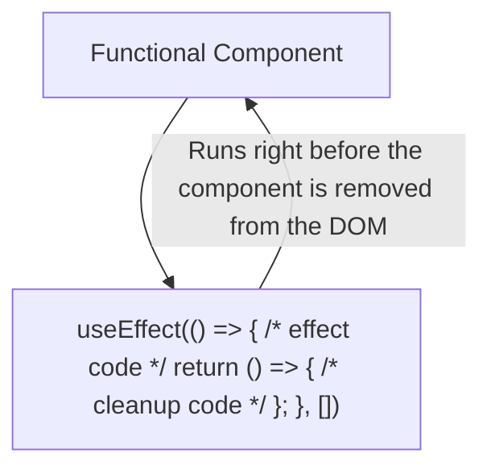
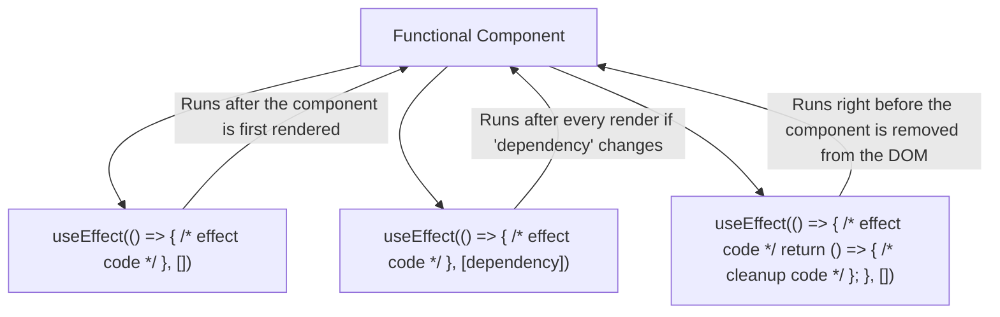

## Scenario 1: Basic `useEffect`

## Scenario 2: `useEffect` with Dependency

## Scenario 3: useEffect without Dependency Array

## Scenario 4: `useEffect` with cleanup

## Scenario 4: Multiple useEffect

