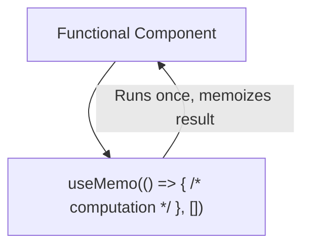
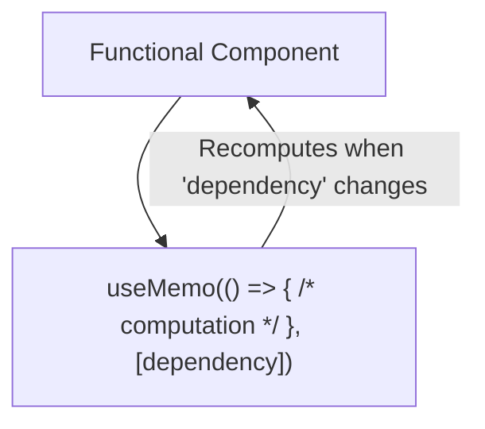
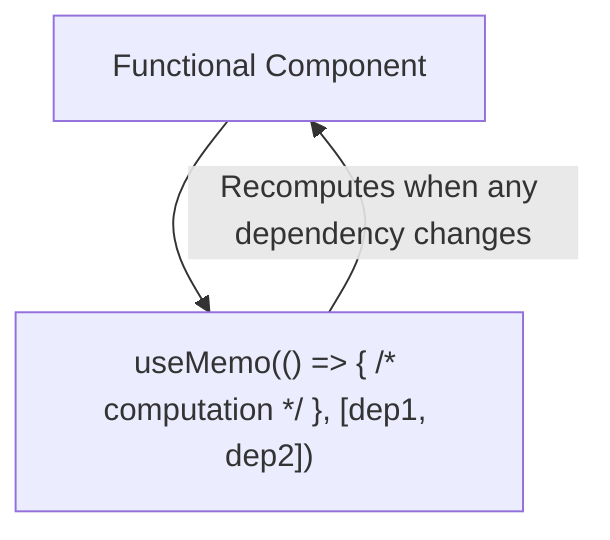
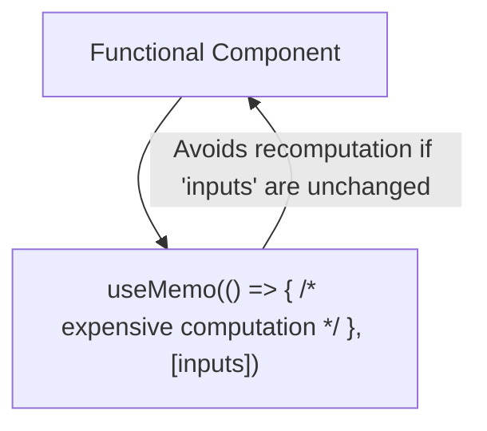
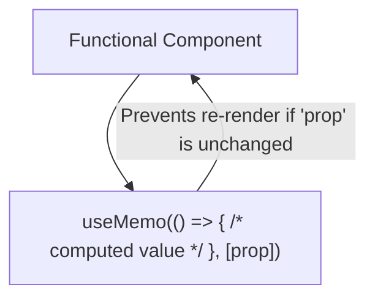

## What is `useMemo`?
`useMemo` returns the memoized value computed by the provided function. This memoized value is calculated only when one of the dependencies in the dependency array changes. If the dependencies haven't changed since the last render, useMemo returns the previously memoized value without recomputing it, helping to optimize performance by avoiding unnecessary calculations.

## Scenario 1: Basic `useMemo` (no dependencies)

```jsx
import React, { useMemo } from 'react';

const Component1 = () => {
    const memoizedValue = useMemo(() => {
        // computation
        return someResult;
    }, []);

    return <div>{memoizedValue}</div>;
};
```

## Scenario 2: `useMemo` with Single Dependency

```jsx
import React, { useMemo } from 'react';

const Component2 = ({ dependency }) => {
    const memoizedValue = useMemo(() => {
        // computation
        return someResult;
    }, [dependency]);

    return <div>{memoizedValue}</div>;
};
```

## Scenario 3: `useMemo` with Multiple Dependencies

```jsx
import React, { useMemo } from 'react';

const Component3 = ({ dep1, dep2 }) => {
    const memoizedValue = useMemo(() => {
        // computation
        return someResult;
    }, [dep1, dep2]);

    return <div>{memoizedValue}</div>;
};
```
## Scenario 4: `useMemo` for Expensive Computation

```jsx
import React, { useMemo } from 'react';

const Component4 = ({ input1, input2 }) => {
    const expensiveComputation = useMemo(() => {
        // expensive computation
        return result;
    }, [input1, input2]);

    return <div>{expensiveComputation}</div>;
};
```

## Scenario 5: `useMemo` to Avoid Unnecessary Re-renders

```jsx
import React, { useMemo } from 'react';

const Component5 = ({ prop }) => {
    const memoizedValue = useMemo(() => {
        return computeValue(prop);
    }, [prop]);

    return <div>{memoizedValue}</div>;
};
```
