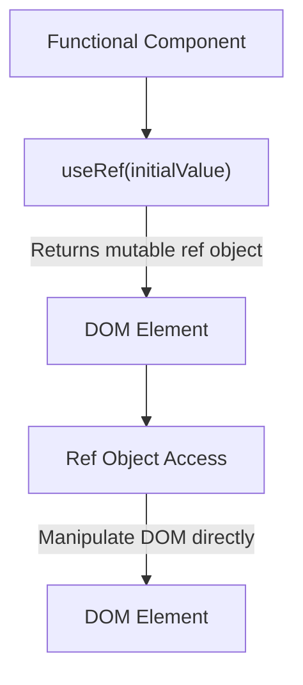

# `useRef` Hook in React

The `useRef` hook is used to create a mutable reference that persists across renders. It can be used for accessing DOM elements or keeping any mutable value around.


## Usage

- `useRef` returns a mutable object with a `.current` property.
- Unlike state, changing a `useRef` value does not trigger a re-render.

## Syntax

```jsx
const refContainer = useRef(initialValue);
```
- **initialValue:** The initial value passed to the `useRef` hook.
  
## xample: Accessing a DOM Element
In this example, we'll use useRef to focus an input field when a button is clicked.

```jsx
import React, { useRef } from 'react';

const FocusInput = () => {
    const inputRef = useRef(null);

    const handleFocus = () => {
        // Use the ref to access the input element and call its focus method
        inputRef.current.focus();
    };

    return (
        <div>
            <input ref={inputRef} type="text" placeholder="Click the button to focus me" />
            <button onClick={handleFocus}>Focus the input</button>
        </div>
    );
};

export default FocusInput;
```

## Example: Keeping Mutable Value
In this example, we'll use useRef to keep a count value that persists across renders without triggering a re-render.

```jsx

import React, { useRef, useState } from 'react';

const Counter = () => {
    const renderCount = useRef(0);
    const [count, setCount] = useState(0);

    renderCount.current += 1;

    return (
        <div>
            <p>Render Count: {renderCount.current}</p>
            <p>Count: {count}</p>
            <button onClick={() => setCount(count + 1)}>Increment</button>
        </div>
    );
};

export default Counter;
```

## Benefits
- Direct access to DOM elements.
- Maintains mutable values across renders without causing re-renders.
- Useful for integrating with third-party libraries that require direct DOM manipulation.
