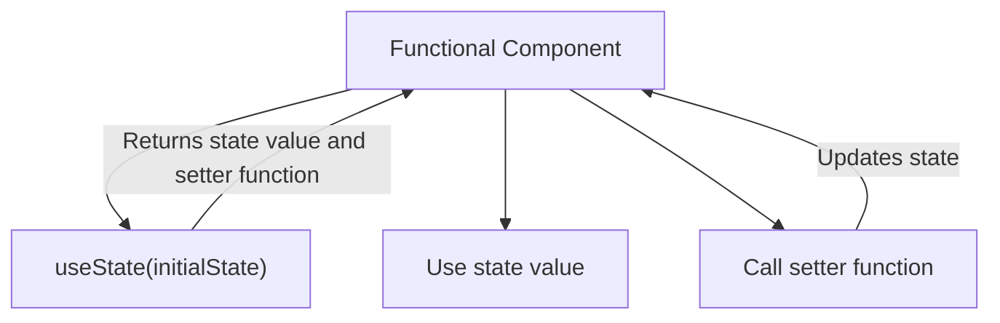

# useState Hook in React

The `useState` hook is a fundamental hook in React used for adding state to functional components.

## Usage

- It is used to declare a state variable within a functional component.
- The `useState` hook returns an array with two elements: the current state value and a function to update the state.

## Syntax

```jsx
const [state, setState] = useState(initialState);
```
- **state:** The current value of the state variable.
- **setState:** A function to update the state variable.

 ```jsx
  import React, { useState } from 'react';

    const Counter = () => {
    const [count, setCount] = useState(0);

    const increment = () => {
        setCount(count + 1);
    };

    return (
        <div>
            <p>Count: {count}</p>
            <button onClick={increment}>Increment</button>
        </div>
    );
};
```


