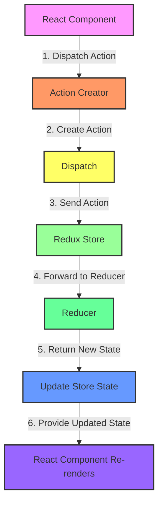

# Redux flow

```mermaid
graph TD;
    A[React Component] -->|1. Dispatch Action| B[Action Creator]
    B -->|2. Create Action| C[Dispatch]
    C -->|3. Send Action| D[Redux Store]
    D -->|4. Forward to Reducer| E[Reducer]
    E -->|5. Return New State| F[Update Store State]
    F -->|6. Provide Updated State| G[React Component Re-renders]

    style A fill:#f9f,stroke:#333,stroke-width:2px;
    style B fill:#f96,stroke:#333,stroke-width:2px;
    style C fill:#ff6,stroke:#333,stroke-width:2px;
    style D fill:#9f9,stroke:#333,stroke-width:2px;
    style E fill:#6f9,stroke:#333,stroke-width:2px;
    style F fill:#69f,stroke:#333,stroke-width:2px;
    style G fill:#96f,stroke:#333,stroke-width:2px;

```
