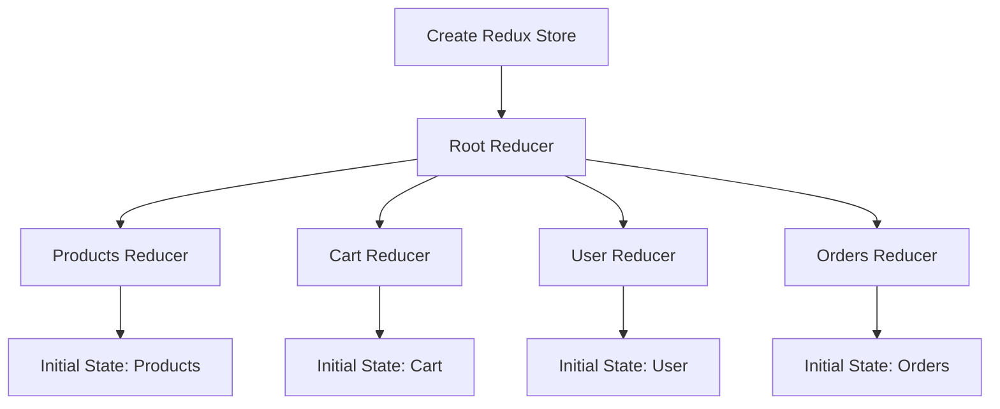
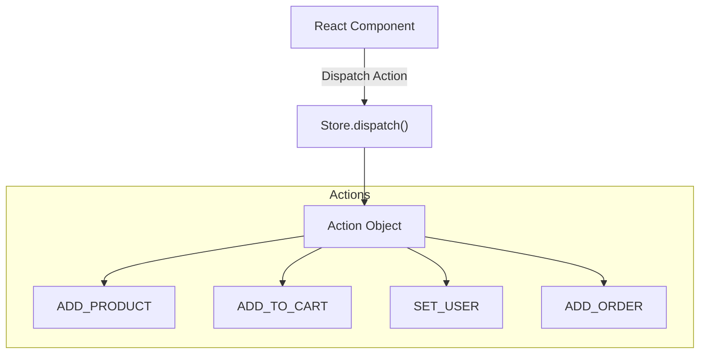
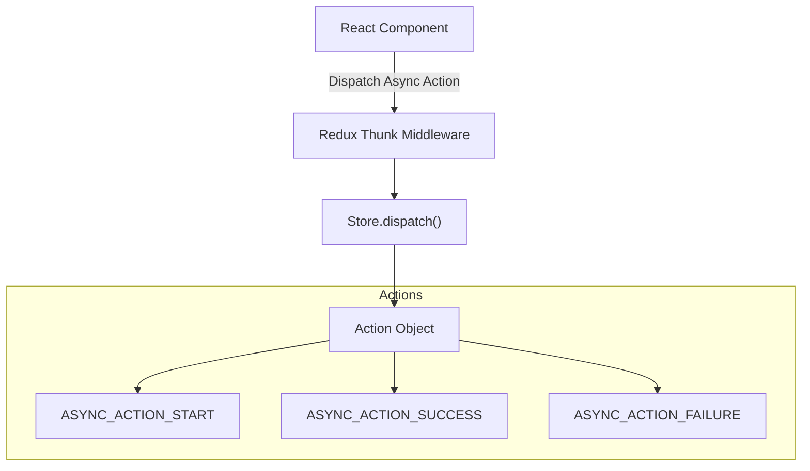
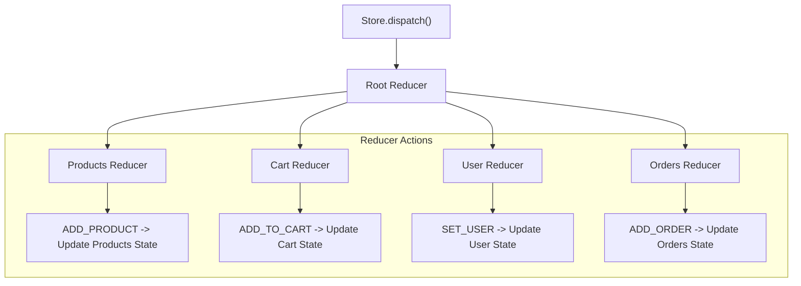
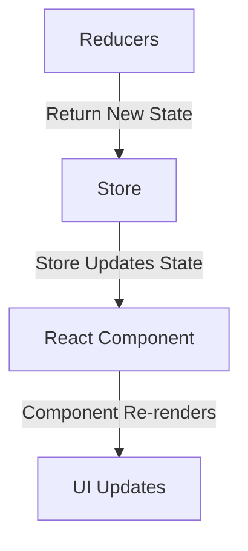
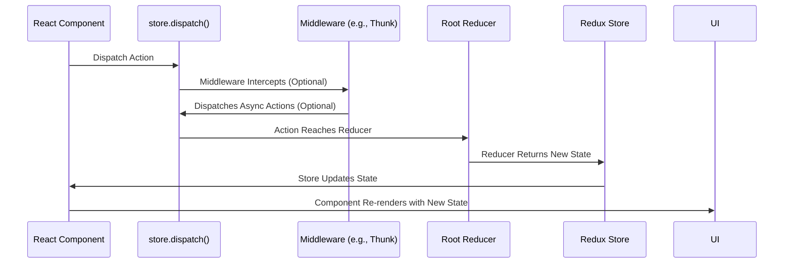

# Redux Flow: Step-by-Step Diagrams

## 1. Initial Setup: Store Creation and Reducers

## 2. Dispatching Actions

## 3. Middleware (Optional, for handling asynchronous actions)

## 4. Reducer Handling

## 5. State Update and React Component Re-rendering

## Full Workflow: From Action Dispatch to State Update

## Explanation:
**Initial Setup:** The Redux store is created with a root reducer that combines individual reducers for managing specific parts of the state.

**Dispatching Actions:** React components dispatch actions to the store using store.dispatch().

**Middleware:** Middleware, such as Redux Thunk, can intercept dispatched actions for handling asynchronous operations before they reach the reducers.

**Reducer Handling:** Actions reach the root reducer, which delegates them to the appropriate individual reducer to update the state.

**State Update and React Component Re-rendering:** The store updates its state based on the reducers' outputs, causing React components to re-render with the new state.
